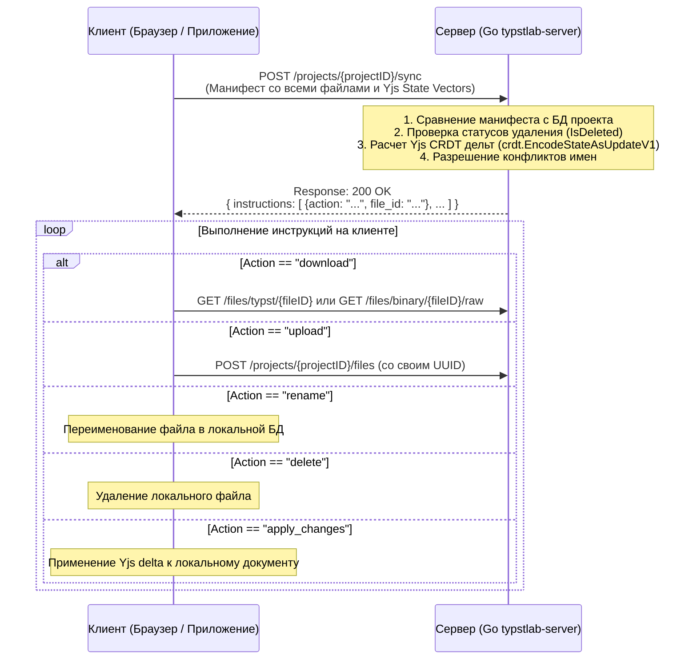

# Спецификация протокола офлайн-синхронизации файлов (Sync Protocol Specification)

Настоящий документ содержит формальное описание архитектуры, протокола взаимодействия, форматов данных и алгоритмов разрешения конфликтов при офлайн-синхронизации файлов в платформе TypstLab.

---

## 1. Общий обзор и архитектура

Для обеспечения синхронизации файлов, созданных или изменённых клиентом в офлайн-режиме, используется двухшаговое рукопожатие («запрос-ответ») при подключении клиента к сети.

### Принципы протокола:
1. **Клиентские UUID:** Все уникальные идентификаторы файлов (`id`) генерируются исключительно на стороне клиента (включая офлайн-режим).
2. **Сервер — источник истины для имён:** При расхождении имени существующего файла сервер принудительно устанавливает актуальное имя (`rename`).
3. **CRDT-синхронизация текста (Yjs):** Для текстовых файлов Typst передаётся только лёгкий вектор состояния `yjs_state_vector` (~10–100 байт). Сервер вычисляет недостающую дельту и передаёт её клиенту в инструкции `apply_changes`.
4. **Единый эндпоинт загрузки:** Клиент загружает бинарные и Typst-файлы через единый метод `POST /projects/{projectID}/files`.

---

## 2. Диаграмма взаимодействия (Sequence Diagram)



---

## 3. Эндпоинт и форматы данных

### 3.1. Запрос клиентов (Manifest Request)

**HTTP Method & Path:** `POST /projects/{projectID}/sync`  
**Headers:**  
* `Authorization: Bearer <JWT_TOKEN>`  
* `Content-Type: application/json`  

```json
{
  "files": [
    {
      "id": "c30980ef-51eb-47eb-ba05-89416a5db202",
      "name": "main.typ",
      "type": "typst",
      "yjs_state_vector": "base64_encoded_state_vector_here"
    },
    {
      "id": "e8a34bc1-443b-417d-8153-f7256561129b",
      "name": "diagram.png",
      "type": "binary"
    }
  ]
}
```

#### Описание полей запроса:
| Поле | Тип | Обязательность | Описание |
| :--- | :--- | :---: | :--- |
| `files` | `Array<SyncFileRequest>` | Да | Список файлов, находящихся в локальном хранилище клиента. |
| `files[].id` | `UUID (string)` | Да | Уникальный идентификатор файла (сгенерирован клиентом). |
| `files[].name` | `string` | Да | Имя файла с расширением (например, `main.typ` или `logo.png`). |
| `files[].type` | `enum ("typst", "binary")` | Да | Тип файла. |
| `files[].yjs_state_vector` | `Base64 (string)` | Нет | Вектор состояния Yjs (передаётся только для `type: "typst"`). |

---

### 3.2. Ответ сервера (Instructions Response)

**HTTP Status:** `200 OK`  
**Content-Type:** `application/json`  

```json
{
  "instructions": [
    {
      "action": "download",
      "file_id": "f5127cd9-4099-4c12-a74e-6e4695e263ab"
    },
    {
      "action": "upload",
      "file_id": "e8a34bc1-443b-417d-8153-f7256561129b"
    },
    {
      "action": "rename",
      "file_id": "c30980ef-51eb-47eb-ba05-89416a5db202",
      "new_name": "main_conflict.typ"
    },
    {
      "action": "delete",
      "file_id": "d7729fca-982c-47bc-8919-4822abf12351"
    },
    {
      "action": "apply_changes",
      "file_id": "c30980ef-51eb-47eb-ba05-89416a5db202",
      "delta": "base64_encoded_crdt_delta_here"
    }
  ]
}
```

#### Описание полей ответа:
| Поле | Тип | Описание |
| :--- | :--- | :--- |
| `instructions` | `Array<SyncInstruction>` | Список команд, которые клиент должен выполнить последовательно. |
| `instructions[].action` | `enum` | Тип действия: `"download"`, `"upload"`, `"rename"`, `"delete"`, `"apply_changes"`. |
| `instructions[].file_id` | `UUID (string)` | Идентификатор файла, к которому относится действие. |
| `instructions[].new_name` | `string` | Новое имя файла (передаётся только для `action: "rename"`). |
| `instructions[].delta` | `Base64 (string)` | Двоичная дельта обновлений Yjs (передаётся только для `action: "apply_changes"`). |

---

## 4. Алгоритм обработки инструкций (`action`)

1. **`download`**:
   - Выдаётся, если файл существует на сервере, но отсутствует в манифесте клиента.
   - Клиент запрашивает контент через `GET /files/typst/{fileID}` или `GET /files/binary/{fileID}/raw`.

2. **`upload`**:
   - Выдаётся, если файл был создан клиентом локально в офлайне и отсутствует на сервере.
   - Клиент отправляет контент и свой UUID на `POST /projects/{projectID}/files`.

3. **`rename`**:
   - Выдаётся в двух случаях:
     a) Имя локального файла с данным ID отличается от имя файла на сервере $\rightarrow$ клиенту присылается актуальное имя с сервера.
     b) Имя офлайн-файла совпадает с уже занятым именем другого файла на сервере $\rightarrow$ клиенту присылается сгенерированное имя с суффиксом (например, `filename_conflict.typ`).

4. **`delete`**:
   - Выдаётся, если файл был удалён на сервере (зафиксирован статус `IsDeleted`).
   - Клиент удаляет файл из локальной базы/кэша.

5. **`apply_changes`**:
   - Выдаётся для Typst-файлов, если на сервере есть обновления, отсутствующие у клиента.
   - Сервер рассчитывает дельту: `crdt.EncodeStateAsUpdateV1(serverDoc, clientStateVector)`.
   - Клиент применяет полученную дельту `delta` к своему локальному Yjs-документу.
