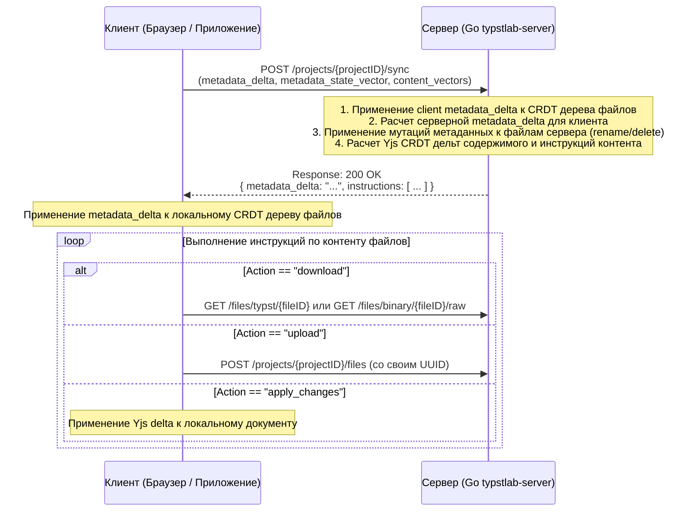

# Спецификация протокола офлайн-синхронизации файлов (Sync Protocol Specification)

Настоящий документ содержит формальное описание архитектуры, протокола взаимодействия, форматов данных и алгоритмов разрешения конфликтов при офлайн-синхронизации файлов в платформе TypstLab.

---

## 1. Общий обзор и архитектура

Для обеспечения синхронизации файлов, созданных или изменённых клиентом в офлайн-режиме, используется двухшаговое рукопожатие («запрос-ответ») при подключении клиента к сети.

### Принципы протокола:
1. **Клиентские UUID:** Все уникальные идентификаторы файлов (`id`) генерируются исключительно на стороне клиента (включая офлайн-режим).
2. **CRDT-синхронизация дерева файлов (Metadata):** Имена файлов, структура и статусы удаления синхронизируются через Yjs CRDT метаданных проекта (`metadata_delta` и `metadata_state_vector`) автоматически и бесконфликтно.
3. **CRDT-синхронизация содержимого Typst (Yjs):** Для текстовых файлов Typst клиент передаёт карту векторов состояния `content_vectors` (`fileID -> state_vector`). Сервер вычисляет недостающую дельту и передаёт её клиенту в инструкции `apply_changes`.
4. **Единый эндпоинт загрузки:** Клиент загружает созданные в офлайне бинарные и Typst-файлы через единый метод `POST /projects/{projectID}/files`.

---

## 2. Диаграмма взаимодействия (Sequence Diagram)


```mermaid
sequenceDiagram
    participant Client as Клиент (Браузер / Приложение)
    participant Server as Сервер (Go typstlab-server)
    
    Client->>Server: POST /projects/{projectID}/sync <br/> (metadata_delta, metadata_state_vector, content_vectors)
    Note over Server: 1. Применение client metadata_delta к CRDT дерева файлов<br/>2. Расчет серверной metadata_delta для клиента<br/>3. Применение мутаций метаданных к файлам сервера (rename/delete)<br/>4. Расчет Yjs CRDT дельт содержимого и инструкций контента
    Server-->>Client: Response: 200 OK <br/> { metadata_delta: "...", instructions: [ ... ] }
    
    Note over Client: Применение metadata_delta к локальному CRDT дереву файлов
    
    Loop Выполнение инструкций по контенту файлов
        alt Action == "download"
            Client->>Server: GET /files/typst/{fileID} или GET /files/binary/{fileID}/raw
        else Action == "upload"
            Client->>Server: POST /projects/{projectID}/files (со своим UUID)
        else Action == "apply_changes"
            Note over Client: Применение Yjs delta к локальному документу
        end
    end
```

---

## 3. Эндпоинт и форматы данных

### 3.1. Запрос клиентов (Sync Request)

**HTTP Method & Path:** `POST /projects/{projectID}/sync`  
**Headers:**  
* `Authorization: Bearer <JWT_TOKEN>`  
* `Content-Type: application/json`  

```json
{
  "metadata_delta": "base64_encoded_crdt_delta_here",
  "metadata_state_vector": "base64_encoded_state_vector_here",
  "content_vectors": {
    "c30980ef-51eb-47eb-ba05-89416a5db202": "base64_encoded_typst_text_state_vector"
  }
}
```

#### Описание полей запроса:
| Поле                    | Тип                        | Обязательность | Описание                                                                  |
|:------------------------|:---------------------------|:--------------:|:--------------------------------------------------------------------------|
| `metadata_delta`        | `Base64 (string)`          |      Нет       | Двоичная дельта изменений CRDT дерева файлов (переименования, удаление).  |
| `metadata_state_vector` | `Base64 (string)`          |      Нет       | Вектор состояния метаданных проекта на клиенте.                           |
| `content_vectors`       | `Map<UUID, Base64 string>` |      Нет       | Векторы состояния Yjs для текста Typst-файлов (`fileID -> state_vector`).  |

---

### 3.2. Ответ сервера (Sync Response)

**HTTP Status:** `200 OK`  
**Content-Type:** `application/json`  

```json
{
  "metadata_delta": "base64_encoded_crdt_delta_here",
  "instructions": [
    {
      "action": "download",
      "file_id": "f5127cd9-4099-4c12-a74e-6e4695e263ab"
    },
    {
      "action": "upload",
      "file_id": "e8a34bc1-443b-417d-8153-f7256561129b"
    },
    {
      "action": "apply_changes",
      "file_id": "c30980ef-51eb-47eb-ba05-89416a5db202",
      "delta": "base64_encoded_crdt_delta_here"
    }
  ]
}
```

#### Описание полей ответа:
| Поле                      | Тип                      | Описание                                                                           |
|:--------------------------|:-------------------------|:-----------------------------------------------------------------------------------|
| `metadata_delta`          | `Base64 (string)`        | Двоичная дельта обновлений CRDT метаданных проекта для применения на клиенте.      |
| `instructions`            | `Array<SyncInstruction>` | Список команд, которые клиент должен выполнить для синхронизации контента файлов.   |
| `instructions[].action`   | `enum`                   | Тип действия: `"download"`, `"upload"`, `"apply_changes"`.                          |
| `instructions[].file_id`  | `UUID (string)`          | Идентификатор файла, к которому относится действие.                                |
| `instructions[].delta`    | `Base64 (string)`        | Двоичная дельта обновлений Yjs (передаётся только для `action: "apply_changes"`).  |

---

## 4. Алгоритм обработки инструкций (`action`)

1. **`metadata_delta`**:
   - Применяется клиентом к локальному CRDT-документу метаданных проекта. Автоматически и бесконфликтно синхронизирует имена файлов (включая бинарные) и статусы удаления.

2. **`download`**:
   - Выдаётся, если файл существует на сервере, но отсутствует в локальном манифесте клиента.
   - Клиент запрашивает контент через `GET /files/typst/{fileID}` или `GET /files/binary/{fileID}/raw`.

3. **`upload`**:
   - Выдаётся, если файл был создан клиентом локально в офлайне и отсутствует на сервере.
   - Клиент отправляет контент и свой UUID на `POST /projects/{projectID}/files`.

4. **`apply_changes`**:
   - Выдаётся для Typst-файлов, если на сервере есть обновления текста, отсутствующие у клиента.
   - Сервер рассчитывает дельту: `crdt.EncodeStateAsUpdateV1(serverDoc, clientStateVector)`.
   - Клиент применяет полученную дельту `delta` к своему локальному Yjs-документу.


